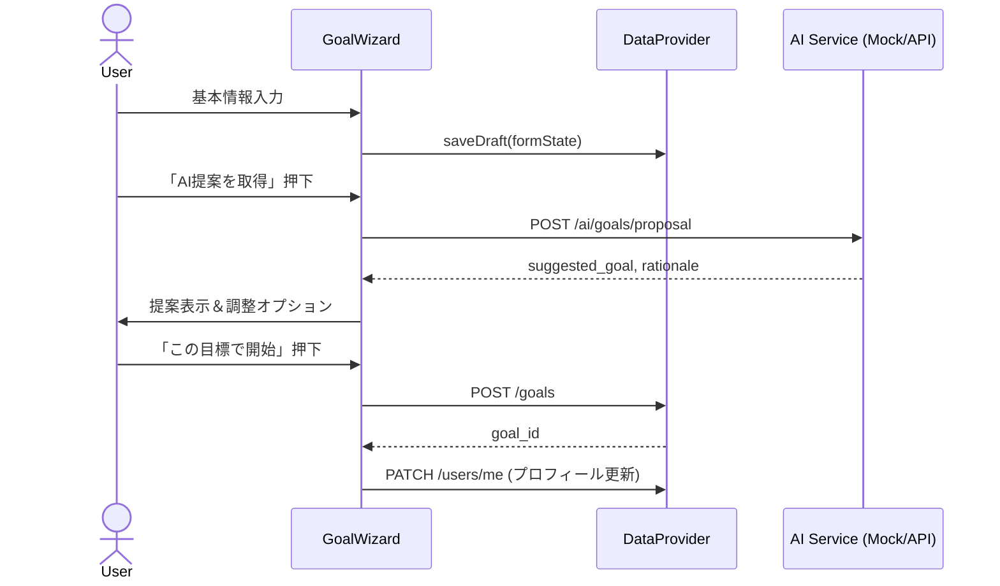
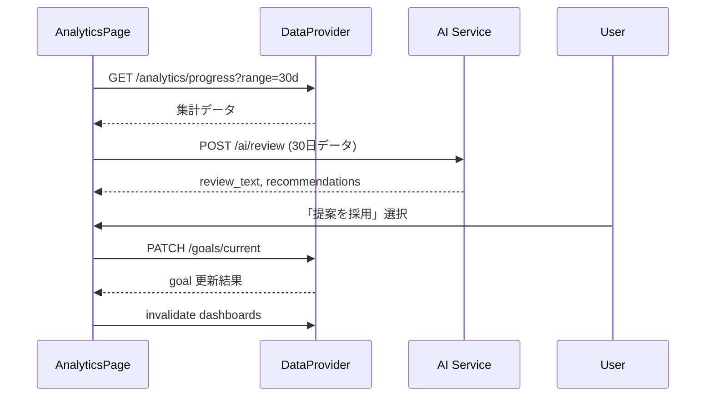

# NutriAI 機能詳細設計書

## 1. 文書目的
- 機能一覧`F-XX`の要件を具体的な処理フロー・データ連携・UI/サービス連携へ落とし込み、実装・テスト・モック運用の基準を定義する。
- 画面設計書、API設計書、DB設計書、コンポーネント設計書との整合を確認し、トレーサビリティを維持する。

## 2. 共通アーキテクチャ指針
- 状態管理: React Queryを主とし、フォームや一時データはZustand(またはReact Context)で補完。
- DataProvider: `mockAdapter` / `restAdapter` の2種を用意し、`useAppServices()`で依存注入。
- エラーハンドリング: API失敗時はトースト表示＋リトライ。オフライン時はIndexedDBの`sync_queue`へ保留。
- モック戦略: MSWでAPIスタブ。画像＆LLM処理はPromiseを使ったダミー実装で300ms遅延を挿入しUXを検証。

## 3. 機能別詳細

### F-01 初期設定 & AI目標提案
- 対応画面/コンポーネント: `SCR-02 GoalWizard`, `GoalWizardStepper`, `GoalSummaryCard`。
- 入力データ: 身長、体重、体脂肪率、年齢、性別、活動レベル、希望増減量、期間。
- 処理フロー:

- バリデーション: 身長/体重/体脂肪率は範囲チェック(身長100-220、体重30-200、体脂肪率0-70)。未入力はAI提案時に警告。
- モック動作: 入力値からBMR/TDEEを簡易算出するスタブを実装。`duration_weeks`は希望値がなければ12週デフォルト。
- エラー時: AI提案エラー→手動入力モードを表示。目標登録失敗→ローカルにドラフト保存しダッシュボードで再送導線。

### F-02 ダッシュボードサマリー
- 対応画面/コンポーネント: `SCR-03 DashboardPage`, `SummaryCard`, `TaskList`.
- データ取得: `GET /dashboard/today`で日次集計+タスク情報を取得。日付変更で`date`クエリを付与。
- 表示要素: カロリーリング、PFCバー、体重ミニグラフ(最新7日)、今日のタスク(朝食記録、運動記録など)。
- 更新タイミング: 食事/運動/体重登録成功時にReact Queryの`dashboard`キーを`invalidate`.
- モック動作: JSONテンプレートを用意し、時間帯で進捗率を変化させる。タスクは`status: pending/completed`で管理。
- エラー/オフライン: キャッシュデータ表示 + オフラインバナー。再取得失敗時はトーストで通知。

### F-03 食事記録(写真AI推定)
- 対応画面/コンポーネント: `SCR-04 MealLogPage`, `PhotoCapture`, `MacroAdjuster`, `MealHistoryList`.
- 入力フロー:
  1. 写真選択またはカメラ起動 → `photo_url`をローカルで生成。
  2. 補足テキスト入力(`notes`)。
  3. 「AI推定する」ボタン → `POST /ai/meals/estimate`。
  4. 推定結果カードでPFCを確認・スライダーで修正。
  5. 「登録」押下 → `POST /meals`。
- モック仕様: AI推定はサンプルメニュー3種をランダム返却。信頼度`confidence`を0.6-0.9で付与。
- エッジケース: 画像未選択で登録しようとした場合はバリデーションエラー。推定失敗時は手動入力フォームを展開。
- 同期処理: 登録成功後、`daily_summaries`と`meal_items`が更新される想定でダッシュボードを再取得。
- 画像アップロード: モックは`blob:`URLで即時表示。本番時は事前署名URLを取得して`PUT` → 成功後に`photo_url`を受領。

### F-04 JANコード検索
- 対応画面/コンポーネント: `SCR-05 BarcodeSearchPage`, `BarcodeScanner`, `FoodResultList`.
- 処理フロー:
  - カメラ/テキスト検索 → `GET /foods/barcode/{jan}` or `GET /foods/search?q=`.
  - ヒットした食品を選択して食事記録へ引き継ぎ(モーダル閉じて`MealLogPage`に`food_id`を渡す)。
  - 未登録時は`FoodManualForm`を表示し、`POST /foods`(管理者レビュー待ち)に送信(Phase2)。
- モック: 検索クエリに対しローカルJSONから部分一致。バーコード読み取りはテキスト入力で代替し、成功/失敗パターンをトグルで切り替え。
- エラー: 0件の場合は「手動登録」CTAを表示。検索失敗時は再試行ボタン。

### F-05 運動記録
- 対応画面/コンポーネント: `SCR-06 ExerciseLogPage`, `ExerciseForm`, `ExerciseTemplateList`.
- 処理: テンプレート選択→強度/時間入力→消費カロリーを即時計算→`POST /exercises/logs`。
- カロリー計算: `calories = MET * 3.5 * weight_kg / 200 * duration_min`. 体重は最新`body_metrics`から取得。モックでは体重65kg固定。
- テンプレート管理: フロント内JSON(`exercise-templates.json`)から読み込み。ユーザー作成テンプレートは`POST /exercises/templates`(Phase2)。
- 同期: 記録成功後にダッシュボードと`daily_summaries`を更新。

### F-06 体重・体脂肪ログ
- 対応画面/コンポーネント: `SCR-03 WeightInlineInput`, `SCR-07 AnalyticsPage`.
- 入力: 日付と体重/体脂肪率を入力し`POST /body-metrics`。同日二重登録時は上書き確認ダイアログ。
- 表示: 直近30日グラフ、目標との差分。`AnalyticsPage`では期間フィルターで`GET /analytics/progress?range=30d`などを利用。
- モック: 体重データをサイン波+トレンドで生成。新規入力をローカルで配列にpushしてグラフへ即時反映。
- エラー: 体重<20kgや>300kgは拒否。通信失敗時はローカルキューに保管し成功時に同期。

### F-07 月次レビュー & TDEE再提案
- 対応画面/コンポーネント: `SCR-07 ReviewCard`, `GoalAdjustmentDialog`.
- フロー:

- モック: `review_text`は複数テンプレから選択。目標採用時は`target_calorie_intake`を±150kcalで調整。
- エラー: AI呼び出し失敗→前回レビューを表示。ゴール更新失敗→警告を出し、後から再実行できるようにする。

### F-08 LLMチャット相談
- 対応画面/コンポーネント: `SCR-08 ChatPage`, `ChatTimeline`, `ChatComposer`.
- 入出力: ユーザー入力→`POST /ai/chat`→返信・推奨アクション。
- セッション管理: `session_id`を保持し、24時間でローテーション。新規セッション作成時は`POST /chat/sessions`(Phase2)。
- モック: Topic別プリセット回答。「栄養」「トレーニング」「気持ち」でテンプレを分岐。レスポンス遅延300ms。
- ストリーミング: 将来はSSEを計画。現状は単発レスポンス。
- エラー: 失敗時はリトライ気泡を表示し、バックオフ付きで再送。連続失敗でチャットガイドラインを提示。

### F-09 通知・リマインダー
- 対応画面/コンポーネント: `SummaryTaskList`, `ReminderSettings`(将来)。
- 目的: 記録漏れ防止。Phase1はダッシュボードタスクリストで代替。
- 処理: `GET /dashboard/today`のレスポンスに`tasks`配列(例: `{"type":"log_meal","status":"pending","deadline":"18:00"}`)を含め、表示・完了操作を制御。
- モック: 時刻に応じてタスク状態を切り替える。完了操作はフロントローカルのみ。
- 将来拡張: Service WorkerでPWA通知、`POST /notifications/register`でPushトークン登録、`/notifications/snooze`で後回し設定。

## 4. テスト観点
- フロー試験: ユースケース UC-01〜UC-06 をE2E (Playwright)で検証。モックサーバを利用し入力→結果の整合性を確認。
- バリデーション: 数値入力境界値、AI提案失敗時のフォールバック、オフライン時再送キューの動作。
- アクセシビリティ: フォーカス移動、スクリーンリーダー用ラベル、チャット画面のロール属性。

## 5. 今後の課題
- AIモデル選定と提示ロジックの精緻化(信頼度に応じたUI変化)。
- 画像アップロードの圧縮・EXIF除去処理の実装。
- 目標/サマリーの多言語対応と単位変換(kg⇔lbs)。
