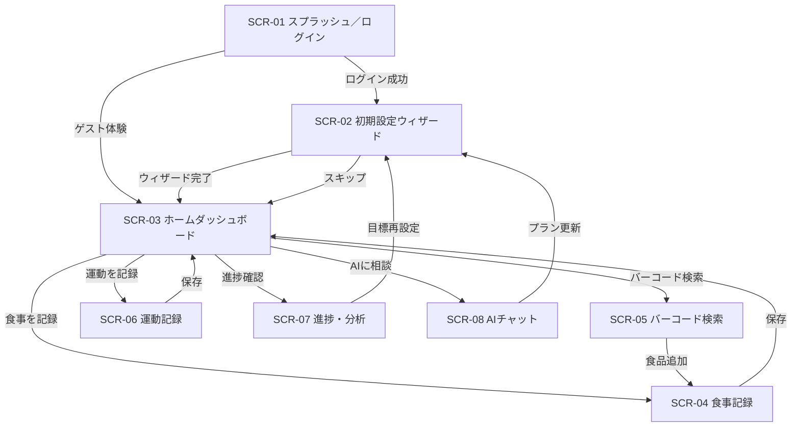

# NutriAI 画面設計書

## 1. 画面一覧
| 画面ID | 画面名 | 主要目的 | 主な要素 | 備考 |
| --- | --- | --- | --- | --- |
| SCR-01 | スプラッシュ／ログイン | ブランド認知と認証導線 | ロゴ、SNSログイン、ゲスト体験 | モック期間は疑似ログインボタンで擬似ユーザーを選択 |
| SCR-02 | 初期設定／AI目標ウィザード | 基本情報入力とAI目標提案 | ステッパー、入力フォーム、AI提案カード | 入力内容はローカル状態→モックAPIへ送信 |
| SCR-03 | ホームダッシュボード | 当日の状況把握と行動促進 | サマリーカード、タスクリスト、グラフ | React Queryで`/dashboard`モックエンドポイントを参照 |
| SCR-04 | 食事記録 | 食事登録とマクロ編集 | 写真アップロード、推定結果カード、手動編集フォーム | AI推定結果はモックで固定レスポンス／後日API置換 |
| SCR-05 | バーコード検索 | JANコード読取と食品登録 | カメラビュー、検索結果一覧、登録フォーム | モックでは検索入力ボックス＋サンプルリストで代替 |
| SCR-06 | 運動記録 | 消費カロリーの記録 | 種目検索、入力フォーム、週次グラフ | テンプレートはローカルJSONシードから取得 |
| SCR-07 | 進捗・分析 | 中長期の成果確認 | 体重グラフ、カロリー比較、AIコメント | 月次レビュー生成はモックレスポンスを表示 |
| SCR-08 | AIチャット | 悩み相談とフィードバック | チャットバブル、プリセットチップ、メッセージ入力 | モックではプリセット回答を返すスタブサーバを利用 |

## 2. UI共通仕様
- カラーパレット: プライマリ #42B883、アクセント #2F855A、背景 #FFFFFF/#F5FBF6。
- タイポグラフィ: 見出しは`Noto Sans JP` Bold、本文は`Noto Sans JP` Regular。英数字は`Inter`。
- グリッド: 8pxベースのスパシング。モバイルは1カラム、タブレット以上は12カラム。
- ボタン: 主要導線はフィルドボタン(緑ベース)、副次はアウトライン、危険操作は赤系。
- アイコン: Heroiconsを採用。食事・運動・チャットなどカテゴリ別に色分け。
- ダークモード: Phase2で実装予定。現段階はライトテーマ固定。

## 3. 画面詳細

### SCR-01 スプラッシュ／ログイン
- 目的: ブランド印象の形成と初回ログイン導線の提示。
- データソース: ローカル定義のモックユーザー情報。後日OAuth連携。
- 主要コンポーネント: ロゴ、メインコピー、説明スライド、ログインボタン(SNS)、ゲスト体験リンク。
- レイアウトラフ:
```
+---------------------------------------+
| NutriAI ロゴ                          |
| 「とにかく楽にダイエットをサポート」 |
|  [スクリーンショットモックカルーセル]|
|  Primary: [Googleで始める]            |
|  Secondary: [メールアドレスで登録]    |
|  Ghost: [ゲストモードで試す]          |
+---------------------------------------+
```
- 状態/バリエーション: API遷移前はローディング表示。ゲストモードはモックデータセットを選択してダッシュボードへ遷移。

### SCR-02 初期設定／AI目標ウィザード
- 目的: ユーザーの基本情報を収集し、AIによる目標案を提示。
- データソース: フォーム入力を一時保持→`/ai/goals/proposal`モックAPI。
- 主要コンポーネント: プログレスステッパー(1.基本情報 2.身体データ 3.運動習慣 4.確認)、入力フォーム、AI提案カード、承認ボタン。
- レイアウトラフ:
```
ヘッダー(戻る/スキップ)
ステップ表示 1/4
[質問カード] 身長 (数値入力)
[質問カード] 体重 (数値入力)
[質問カード] 体脂肪率 (選択または不明チェック)
Footer: [次へ] [後で設定]
```
- 状態/バリエーション: 入力途中保存、AI提案ロード中、AIエラー時に手動設定モードを提示。PWAではIndexedDBにドラフト保存。

### SCR-03 ホームダッシュボード
- 目的: 当日の進捗把握と次のアクション促進。
- データソース: `useDashboardQuery`でモックAPIからJSON取得。ローカルステートで日付変更に対応。
- 主要コンポーネント: 日付セレクター、摂取/消費カロリーリング、PFCバランスバー、体重ミニグラフ、タスクリスト、ショートカットカード(食事登録・写真撮影・チャット)。
- レイアウトラフ:
```
AppBar(今日, 設定アイコン)
[摂取 vs 目標 リングチャート]
[PFC Horizontal Bars]
[体重ミニラインチャート]
[タスクリスト]
  - 朝食を記録する [開始]
  - 運動を記録する [開始]
[AIからのひとこと]
```
- 状態/バリエーション: 日付切替、タスクリスト完了状態、AIコメント有無、ネットワークオフライン時にローカルキャッシュバッジを表示。

### SCR-04 食事記録
- 目的: 食事を手間なく登録し、AI推定結果を確認・修正する。
- データソース: 写真アップロードはモックでローカルURL生成、`/ai/meals/estimate`モックがマクロ値を返す。
- 主要コンポーネント: カメラボタン、画像プレビュー、補足テキスト入力、推定結果カード(PFC)、編集フォーム、保存ボタン、履歴タブ。
- レイアウトラフ:
```
ヘッダー(食事種別タブ: 朝/昼/夜/間食)
[写真を追加する] or [カメラを起動]
[補足メモ入力]
[AI推定結果カード]
  P: 40g  P調整スライダー
  F: 15g  F調整スライダー
  C: 65g  C調整スライダー
[登録ボタン]
[過去の登録一覧]
```
- 状態/バリエーション: 写真未選択時、推定中ローディング、AIエラーで手動入力モードへフォールバック。モックデータはサンプルメニューでプレフィル。

### SCR-05 バーコード検索
- 目的: JANコードやキーワードから食品を素早く登録。
- データソース: モックフェーズでは`foods.json`から検索。将来は`/foods/barcode`。
- 主要コンポーネント: 検索バー、カメラプレビュー、結果リスト、詳細カード、登録ボタン、未登録食品フォーム。
- レイアウトラフ:
```
[バーコードスキャンを開始する]
または
[キーワード入力フィールド]
[検索結果リスト]
  - 商品名 / 1食あたり栄養表示
  - [追加]ボタン
[見つからない場合はこちら] -> 手動登録モーダル
```
- 状態/バリエーション: スキャン中オーバーレイ、結果0件時の案内、手動登録フォーム送信完了でレビュー待ちメッセージを表示。

### SCR-06 運動記録
- 目的: 運動内容を登録し、消費カロリーを算出。
- データソース: テンプレートはモックJSON、登録は`/exercises/logs`モック。
- 主要コンポーネント: 日付セレクター、テンプレート検索、運動カード、MET値スライダー、時間入力、消費カロリー表示、履歴リスト。
- レイアウトラフ:
```
AppBar(運動記録)
[日付ピッカー]
[テンプレート検索]
[テンプレートカード]
  スクワット | 強度選択 | 時間入力
  [消費カロリー 180kcal]
[保存] [テンプレートとして保存]
[週次グラフ]
```
- 状態/バリエーション: 強度変更時の即時計算、テンプレート保存モーダル、履歴編集モード。

### SCR-07 進捗・分析
- 目的: 中長期データを可視化し、AIによる振り返りを提示。
- データソース: `useAnalyticsQuery`で月次集計、`/ai/review`モックがコメント生成。
- 主要コンポーネント: 期間フィルター、体重折れ線グラフ、カロリー棒グラフ、マクロ比チャート、AIレビューカード、次のアクションCTA。
- レイアウトラフ:
```
フィルター(月/3ヶ月/6ヶ月)
[体重折れ線グラフ]
[摂取 vs 消費 棒グラフ]
[PFC比率ドーナツ]
[AIレビュー] 「今月は...」
[次の目標を更新]ボタン
```
- 状態/バリエーション: データ不足時のプレースホルダー、AIコメント未取得時のリトライ導線。

### SCR-08 AIチャット
- 目的: 栄養・運動・モチベーションに関する相談を行う。
- データソース: `useChatSession`でモックチャットサーバと通信。将来はWebSocket/SSE。
- 主要コンポーネント: チャットヘッダー、プリセットチップ、メッセージリスト、入力エリア、送信ボタン、フィードバックリアクション。
- レイアウトラフ:
```
AppBar(チャット, セッション切替)
[プリセット: 栄養相談][トレーニング][気持ち]
-----------------------------------------
User: 「昼食後すぐにお腹が空きます」
AI:   「タンパク質...」
-----------------------------------------
[入力フィールド........][送信▶]
```
- 状態/バリエーション: モック期間は即時レスポンス、ネットワークエラー時の再送キュー、満足度リアクションでフィードバックを収集。

## 4. 画面遷移図


### 4.1 ナビゲーションガイドライン
- ボトムタブ(ホーム/食事/運動/分析/チャット)で主要導線を固定し、初回起動時のみウィザードを表示する。
- モバイルはタブナビゲーション、タブレット以上は左サイドバーへ展開するレスポンシブ構造とする。
- 画面遷移は「次の行動」を1つに絞り込み、ダッシュボードから食事撮影とチャットにワンタップで遷移可能にする。
- 例外遷移(設定、ヘルプ)はヘッダーのオーバーフローメニューからアクセスする。

## 5. モックデータとの連携設計
- 画面ごとに`DataProvider`インターフェースを注入し、`MockDataProvider`と`RestDataProvider`を差し替え可能にする。
- リストやグラフにはTypeScript型を付与し、モックJSONはその型に準拠させる。
- 画像アップロード・バーコード検索は`useFakeUploader`／`useFakeScanner`フックでスタブ化。実API導入時は同名フックを差し替える。
