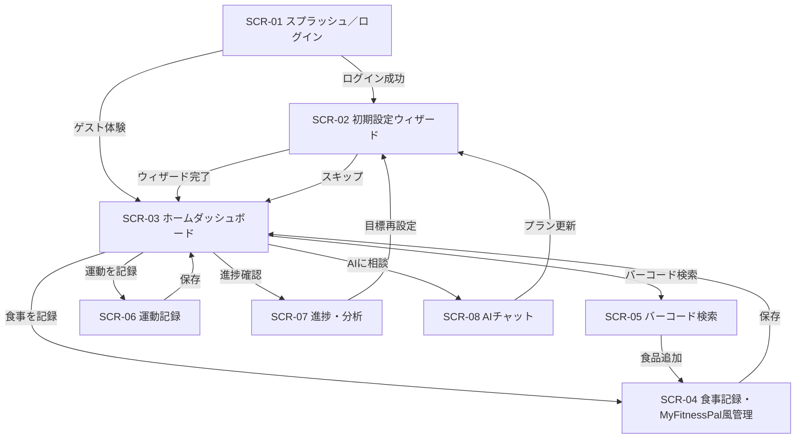

# NutriAI 画面設計書

## 1. 画面一覧
| 画面ID | 画面名 | 主要目的 | 主な要素 | 備考 |
| --- | --- | --- | --- | --- |
| SCR-01 | スプラッシュ／ログイン | ブランド認知と認証導線 | ロゴ、SNSログイン、ゲスト体験 | モック期間は疑似ログインボタンで擬似ユーザーを選択 |
| SCR-02 | 初期設定ウィザード (2025-10-18更新) | 基本情報入力とAI目標提案 | ステッパー、入力フォーム、AI提案カード | 入力内容はローカル状態→モックAPIへ送信 |
| SCR-03 | ホームダッシュボード (2025-10-17更新、2025-10-18更新、2025-10-19更新) | 1日のカロリー・栄養進捗、体重記録、タスク一覧を表示し、各機能へのナビゲーション | ヘッダー（アバター、ロゴ、設定アイコン）、日付ナビゲーション、カルーセル式ダッシュボード（カロリーカード・主要栄養素カード）、体重カード（Collapsible入力）、今日のタスクカード、クイックアクションボタン（食事を記録、運動を記録） | 2025-10-19更新: マイミール・マイフードのボタンを削除し、機能は食事記録画面のタブに統合 |
| SCR-04 | 食事記録・MyFitnessPal風管理 (2025-10-17更新、2025-10-19更新) | 食事写真/手入力で食事を記録し、日毎の栄養素を集計 | 食事記録ページ（日付ナビゲーション、日次サマリー、食事種別セクション）、食品選択ページ（すべて/マイミール/マイフードタブ）、AI写真推定ページ | 2025-10-19更新: 食品選択ページにマイミール・マイフードの管理機能を統合 |
| SCR-05 | バーコード検索 | JANコード読取と食品登録 | カメラビュー、検索結果一覧、登録フォーム | モックでは検索入力ボックス＋サンプルリストで代替 |
| SCR-06 | 運動記録 (2025-10-17リニューアル、2025-10-18更新) | 消費カロリーの記録 | 種目検索、入力フォーム、週次グラフ | テンプレートはローカルJSONシードから取得 |
| SCR-07 | 進捗・分析 (2025-10-17更新、2025-10-18更新) | 体重・体組成の推移、カロリー・栄養バランス分析を可視化し、月次レビューを提供 | 月次レビュー、目標進捗カード、体重入力フォーム、期間フィルター、体重推移グラフ、カロリー比較バー、PFC円グラフ、記録履歴リスト | 2025-10-17更新、2025-10-18更新 |
| SCR-08 | AIチャット | 悩み相談とフィードバック | チャットバブル、プリセットチップ、メッセージ入力 | モックではプリセット回答を返すスタブサーバを利用 |

## 2. UI共通仕様
- カラーパレット: プライマリ #42B883、アクセント #2F855A、背景 #FFFFFF/#F5FBF6。
- タイポグラフィ: 見出しは`Noto Sans JP` Bold、本文は`Noto Sans JP` Regular。英数字は`Inter`。
- グリッド: 8pxベースのスパシング。モバイルは1カラム、タブレット以上は12カラム。
- ボタン（2025-10-19更新）: 主要導線はフィルドボタン(緑ベース)、副次はアウトライン、危険操作は赤系。「+ 追加」ボタンは`text-primary`のゴーストボタンで、ホバー時は背景色を変更せず文字を太くする控えめな効果（`hover:font-semibold`）を適用し、統一感のあるUIを実現。
- アイコン: Heroiconsを採用。食事・運動・チャットなどカテゴリ別に色分け。
- ダークモード: Phase2で実装予定。現段階はライトテーマ固定。
- ボトムナビゲーションバー（2025-10-18更新）: 全画面共通の固定ナビゲーション。左から「運動、食事、ホーム、分析、チャット」の順。アクティブなタブは緑色（primary）で強調表示。

## 3. 画面詳細

### SCR-01 スプラッシュ／ログイン
- 目的: ブランド印象の形成と初回ログイン導線の提示。
- データソース: ローカル定義のモックユーザー情報。後日OAuth連携。
- 主要コンポーネント: ロゴ、メインコピー、説明スライド、ログインボタン(SNS)、ゲスト体験リンク。
- レイアウトラフ:
```
+---------------------------------------+
| NutriAI ロゴ                          |
| 「とにかく楽にダイエットをサポート」 |
|  [スクリーンショットモックカルーセル]|
|  Primary: [Googleで始める]            |
|  Secondary: [メールアドレスで登録]    |
|  Ghost: [ゲストモードで試す]          |
+---------------------------------------+
```
- 状態/バリエーション: API遷移前はローディング表示。ゲストモードはモックデータセットを選択してダッシュボードへ遷移。

### SCR-02 初期設定ウィザード (2025-10-18更新)
- 目的: ユーザー基本情報を収集し、目標を設定してAI提案を生成する。
- データソース: フォーム入力、完了後は`mockGoal`に反映（仮）。
- 主要コンポーネント: プログレスバー、4ステップのフォーム、次へ/戻るボタン、スキップボタン。
- レイアウトラフ（2025-10-18更新）:
```
[← 戻る] ステップ3/4 [スキップ]
━━━━━━━━━━━━━━━━━━━━━━━━━━ (75%)

[活動・運動習慣]
より正確なカロリー計算のため、詳しく教えてください

仕事・日常の活動レベル:
  - デスクワーク（ほぼ座っている）
  - 立ち仕事（販売員、教員など）
  - 動き回る仕事（看護師、配達など）
  - 肉体労働（建設、引越しなど）

週の運動頻度:
  - 運動しない
  - 週1-2回
  - 週3-4回
  - 週5-6回
  - 毎日

[条件付き表示: 運動する場合のみ]
1回あたりの運動時間:
  - 30分未満
  - 30-60分
  - 60-90分
  - 90分以上

運動の強度:
  - 軽い（ウォーキング、ヨガ、ストレッチ）
  - 中程度（ジョギング、サイクリング、水泳）
  - 激しい（ランニング、HIIT、重量挙げ）

日常の移動・通勤:
  - ほぼ座っている（車・電車で移動）
  - 少し歩く（10-20分/日）
  - そこそこ歩く（20-40分/日）
  - よく歩く（40分以上/日）

💡 これらの情報から、あなたの総消費カロリー（TDEE）を
   正確に計算し、最適な目標カロリーを提案します。

[次へ →]
```
- **TDEE計算の詳細化** (2025-10-18):
  - 単一の「活動レベル」から、5つの詳細な質問項目に拡張
  - **仕事の活動レベル**: 座り仕事/立ち仕事/動き回る/肉体労働
  - **週の運動頻度**: なし/週1-2/週3-4/週5-6/毎日
  - **運動時間**: 30分未満/30-60分/60-90分/90分以上（運動する場合のみ表示）
  - **運動の強度**: 軽い/中程度/激しい（運動する場合のみ表示）
  - **日常の移動量**: ほぼ座っている/少し歩く/そこそこ歩く/よく歩く
  - より正確なTDEE（Total Daily Energy Expenditure）計算が可能に
- ステップ構成（2025-10-18更新）:
  1. 基本情報（年齢、性別）
  2. 身体データ（身長、体重、体脂肪率）
  3. 活動・運動習慣（5つの詳細項目）
  4. 目標設定（目標タイプ、目標体重、期間）
- データ構造（2025-10-18更新）:
```typescript
{
  age: number,
  gender: 'female' | 'male' | 'other',
  height: number,
  weight: number,
  bodyFat?: number,
  // TDEE calculation fields
  workActivityLevel: 'desk' | 'standing' | 'moving' | 'physical',
  exerciseFrequency: 'none' | '1-2' | '3-4' | '5-6' | 'daily',
  exerciseDuration?: 'short' | 'medium' | 'long' | 'verylong',
  exerciseIntensity?: 'light' | 'moderate' | 'vigorous',
  dailyMovement: 'minimal' | 'light' | 'moderate' | 'active',
  goalType: 'loss' | 'gain' | 'maintain',
  targetWeight: number,
  duration: number
}
```
- 状態/バリエーション: ステップ遷移、入力検証（未実装）、完了時はAI提案画面へ。運動時間と強度は運動頻度が「運動しない」以外の場合のみ表示。

### SCR-03 ホームダッシュボード (2025-10-17更新、2025-10-18更新、2025-10-22更新)
- 目的: 1日のカロリー・栄養進捗、体重記録、タスク一覧を表示し、各機能へのナビゲーション。
- データソース: `mockDailySummary`、`mockUser`、`mockBodyMetrics`、`mockGoal`。
- 主要コンポーネント: ヘッダー（アバター、ロゴ、設定アイコン）、日付ナビゲーション、カルーセル式ダッシュボード（カロリーカード・主要栄養素カード）、体重カード（Collapsible入力）、今日のタスクカード、クイックアクションボタン。
- レイアウトラフ（2025-10-22更新）:
```
[アバター] 🍏 NutriAI [設定⚙️]  ← ロゴを大きく、緑のりんごアイコン追加、設定アイコンに変更
━━━━━━━━━━━━━━━━━━━━━━━━━━━━━━━━
[← ] 今日 [ →]  ← 日付ナビゲーション、背景色: bg-gray-50
━━━━━━━━━━━━━━━━━━━━━━━━━━━━━━━━

[カルーセル: スワイプで切り替え]
┌─────────────────────┐
│ [カロリー]          │ ← CardHeaderとCardTitleで統一されたデザイン
│─────────────────────│
│ 残り = 目標 - 食事  │
│                     │
│    ┌───────┐        │
│    │ 1000  │        │  ← 円形プログレス (w-36 h-36)
│    │  残り │        │
│    └───────┘        │
│                     │
│ 目標     2000 kcal  │
│ 食事摂取 1000 kcal  │
└─────────────────────┘
┌─────────────────────┐
│ [主要栄養素]        │ ← CardHeaderとCardTitleで統一されたデザイン
│─────────────────────│
│                     │
│  炭水化物  脂質  タンパク質
│   [30g]   [15g]   [25g]  ← 各栄養素の円形プログレス表示
│   /50g    /25g    /45g
│   20g残り 10g残り 20g残り
│                     │
└─────────────────────┘
● ○  ← ページネーションドット

┌─────────────────────┐
│ [体重]              │ ← CardHeaderとCardTitleで統一されたデザイン
│─────────────────────│
│ 現在: 57.4 kg       │
│                     │
│ [今日の体重を記録]  │ → (展開して入力フォーム表示)
└─────────────────────┘

┌─────────────────────┐
│ [今日のタスク]      │ ← CardHeaderとCardTitleで統一されたデザイン
│─────────────────────│
  ✓ 朝食を記録
  ○ 運動を記録 [開始]
  ○ 夕食を記録 [開始]

[食事を記録] [運動を記録]  ← クイックアクション
```
- **カードデザインの統一** (2025-10-22):
  - すべてのカードでCardHeaderとCardTitleコンポーネントを使用し、統一されたデザインに変更
  - カロリーカード、主要栄養素カード: 体重カードと同じ枠線付きデザインに統一
  - 体重カード、今日のタスクカード: 既存のCardHeader/CardTitleデザインを維持
- **カード背景色の統一** (2025-10-18):
  - カルーセル内のカロリーカード、主要栄養素カードは白背景（bg-white）
  - 体重カードは白背景（bg-white）
  - 今日のタスクカードは白背景（bg-white）
  - ページ全体の背景をbg-primary/5（薄い緑）に変更
  - ヘッダーとカードは白、その周りの背景が薄い緑で、視覚的な階層構造を明確化
  - ブランドカラーを活かした一貫性のあるデザインに改善
- **ヘッダーUI改善** (2025-10-18):
  - ロゴサイズを大きく（text-xl）
  - 緑のりんごアイコン（🍏）をロゴの左側に追加
  - 通知アイコンを設定アイコン（Settings）に変更
- **カルーセル式ダッシュボード** (2025-10-18):
  - カロリーカードと主要栄養素カードを左右スワイプで切り替え可能
  - 両カードの高さをh-[340px]で統一し、視覚的な一貫性を確保
  - ページネーションドットで現在位置を表示
- **日付ナビゲーション** (2025-10-17):
  - ChevronLeft/ChevronRightアイコンで前後の日付に移動可能
  - 「今日」「昨日」「明日」を自動判定して表示
- **カロリー表示** (2025-10-17):
  - 円形プログレス表示（w-36 h-36）
  - カロリー計算式を「残り = 目標摂取 - 食事摂取」に変更
  - エクササイズ分を表示から除外
- **主要栄養素カード** (2025-10-17):
  - 「脂肪」→「脂質」に表記を変更
  - 各栄養素の円形プログレス（w-24 h-24）の真下に「残り」テキストを配置
  - gap-6で適切な余白を確保し、3列のレイアウトを整理
- **体重記録機能** (2025-10-17):
  - Collapsibleコンポーネントで展開・折りたたみ可能な入力フォーム
  - 当日の体重のみ記録可能（簡易入力）
  - 詳細な体重記録（任意日付、体脂肪率）は進捗ページで実施
- データ構造: DailySummary (targetCalories, calorieIntake, carbG/targetCarbG, fatG/targetFatG, proteinG/targetProteinG, tasks: Task[])、Task (type, title, status)。
- 状態/バリエーション: 日付選択によるデータ切り替え（仮）、体重入力の開閉状態、タスクの完了/未完了。

### SCR-04 食事記録・MyFitnessPal風管理 (2025-10-17更新)
- 目的: 食事写真/手入力で食事を記録し、日毎の栄養素を集計。
- データソース: `mockMeals`、`mockUser`、`mockGoal`。
- 主要コンポーネント: 食事記録ページ（日付ナビゲーション、日次サマリー、食事種別セクション）、食品選択ページ、AI写真推定ページ。
- 食事記録ページレイアウトラフ（2025-10-18更新）:
```
━━━━━━━━━━━━━━━━━━━━━━━━━━━━━━━━
食事記録
[← ] 今日 [📅] [ →]  ← 日付ナビゲーション
━━━━━━━━━━━━━━━━━━━━━━━━━━━━━━━━

┌─────────────────────┐
│ カロリー  タンパク質 │ ← 日次サマリー（背景: bg-primary/10）
│   141kcal     7g    │    カロリーに「kcal」表記追加
│ 脂質  炭水化物      │    タンパク質・炭水化物はwhitespace-nowrapで改行防止
│   5g     18g        │
└─────────────────────┘

[朝食] 0 kcal [+ 追加]
  (食事アイテムのリスト)

[昼食] 450 kcal [+ 追加]
  鶏胸肉のサラダ 1人前
  200kcal | P:25g F:5g C:10g
  ごはん 150g
  250kcal | P:4g F:1g C:55g

[夕食] 0 kcal [+ 追加]
[間食] 0 kcal [+ 追加]
```
- **UI改善** (2025-10-18):
  - 日次サマリーカードの背景色をbg-primary/10（濃いめの緑）に変更し、視認性を向上
  - カロリーの単位に「kcal」を明記
  - タンパク質と炭水化物のラベルに「whitespace-nowrap」を適用し、スマホ画面で2行に折り返されないよう修正
  - より読みやすく、情報が一目で把握できるUIに改善
- **日付ナビゲーション** (2025-10-17):
  - ChevronLeft/ChevronRight/Calendar アイコンで日付選択
  - 「今日」「昨日」を自動判定して表示
- **日次サマリー** (2025-10-17):
  - カロリー、タンパク質、脂質、炭水化物の合計を表示
- **食事種別セクション** (2025-10-17):
  - 朝食・昼食・夕食・間食の4セクション
  - 各セクションに食事アイテムのリスト、合計カロリー・栄養素を表示
  - [+ 追加]ボタンで食品選択ページに遷移
- **食品選択ページ** (2025-10-17、2025-10-18更新、2025-10-19更新):
  - AI写真推定、バーコード検索、最近の食品、人気の食品からの選択
  - タブ切替: すべて | マイミール | マイフード（3タブ構成）
  - **マイミールタブ**: マイミールの作成・編集・削除機能を統合（MyMealsPageの機能を統合）
  - **マイフードタブ**: マイフードの作成・編集・削除機能を統合（MyFoodsPageの機能を統合）
  - 選択した食品を現在の食事種別に追加
- **AI写真推定ページ** (2025-10-17):
  - 写真アップロード、AI推定結果の表示・編集
  - 食品名、数量、栄養素（タンパク質・脂質・炭水化物）を手動調整可能
  - 保存時に食事記録ページに反映
- データ構造: Meal (id, date, mealType, items: MealItem[], photoUrl?, notes?)、MealItem (id, foodName, quantity, unit, calories, proteinG, fatG, carbG)。
- 状態/バリエーション: 日付選択によるデータ切り替え、食事種別ごとの表示切り替え、食品選択・AI推定モードへの遷移。

### SCR-05 バーコード検索
- 目的: JANコードやキーワードから食品を素早く登録。
- データソース: モックフェーズでは`foods.json`から検索。将来は`/foods/barcode`。
- 主要コンポーネント: 検索バー、カメラプレビュー、結果リスト、詳細カード、登録ボタン、未登録食品フォーム。
- レイアウトラフ:
```
[バーコードスキャンを開始する]
または
[キーワード入力フィールド]
[検索結果リスト]
  - 商品名 / 1食あたり栄養表示
  - [追加]ボタン
[見つからない場合はこちら] -> 手動登録モーダル
```
- 状態/バリエーション: スキャン中オーバーレイ、結果0件時の案内、手動登録フォーム送信完了でレビュー待ちメッセージを表示。

### SCR-06 運動記録 (2025-10-17リニューアル、2025-10-18更新)
- 目的: 運動内容を日毎に登録し、消費カロリーを算出・可視化。
- データソース: テンプレートはモックJSON、日付ごとの運動記録を`Exercise`配列で管理。
- 主要コンポーネント: 日付ナビゲーション（前日/翌日 + カレンダーピッカー）、日次サマリー、運動リスト、追加ダイアログ、週次グラフ。
- レイアウトラフ（2025-10-18更新）:
```
ヘッダー(運動記録)
[← 前日] [今日 / 10月17日] [翌日 →]
[日次サマリーカード] (背景: bg-primary/10で改善)
  消費カロリー: 430 kcal
  2件の運動を記録
[運動記録セクション]
  [+ 追加] ← ダイアログで追加
  - ランニング 30分 中強度 (280kcal) [🗑]
  - スクワット 20分 高強度 (150kcal) [🗑]
[週次サマリー]
  週間グラフ + 統計
```
- **追加ダイアログ**:
```
運動を記録
[運動の種類: ドロップダウン選択]
  - ランニング
  - ウォーキング
  - サイクリング
  - スイミング
  - ウェイトトレーニング（高強度）
  - ウェイトトレーニング（低強度）
  - ヨガ/ピラティス
  - その他
[強度: 低強度 | 中強度 | 高強度] (「その他」選択時は非表示)
[消費カロリー（kcal）: 数値入力] (「その他」選択時のみ表示)
[時間（分）: 数値入力]
[メモ（任意）: 例：朝のジョギング]
消費カロリー: 280 kcal (bg-white border-primary/20で背景改善)
[キャンセル] [保存]
```
- **運動の種類** (2025-10-18更新):
  - ランニング、ウォーキング、サイクリング、スイミング
  - ウェイトトレーニング（高強度）、ウェイトトレーニング（低強度）
  - ヨガ/ピラティス
  - その他（消費カロリーを自由入力）
- **データ構造変更** (2025-10-17):
  - `Exercise`: `date`フィールドで日付管理、`performedAt`廃止、`notes`フィールド追加
- **UI改善** (2025-10-18):
  - 日次サマリーカードの背景色をbg-primary/10（濃いめの緑）に変更し、視認性を向上
  - ダイアログ内の消費カロリー表示の背景色をbg-white border-primary/20に変更し、視認性を向上
  - 「人気の運動」セクションを削除
  - 「その他」選択時に消費カロリーを自由入力できる機能を追加
  - 「その他」選択時は強度選択を非表示に
- 状態/バリエーション: 日付切替、強度変更時のリアルタイムカロリー計算、削除時のトースト通知、週次グラフのデータ更新、「その他」選択時の条件付きフィールド表示。

### SCR-07 進捗・分析 (2025-10-17更新、2025-10-18更新、2025-10-19更新)
- 目的: 体重・体組成の推移、カロリー・栄養バランス分析を可視化し、月次レビューを提供。
- データソース: `mockBodyMetrics`、`mockGoal`。
- 主要コンポーネント: 月次レビュー、目標進捗カード、体重入力フォーム、期間フィルター、体重推移グラフ、カロリー比較バー、PFC円グラフ、記録履歴リスト。
- レイアウトラフ（2025-10-18更新、2025-10-19更新）:
```
ヘッダー(進捗・分析)
体重・体組成の推移と目標達成度を確認
[月次レビューカード] (AIアイコン + 提案)
  - 今月は順調に目標に向かって進んでいます！
  - 推奨される調整: カロリー/タンパク質/運動頻度
  - [提案を採用して目標を更新]
[目標進捗カード]
  開始時: 62.0kg | 現在: 57.4kg | 目標: 55.0kg
  達成度バー (5.1kg減、残り2.4kg)
[体重・体組成を記録]
  記録日: [カレンダー選択]
  体重 (kg): 57.4 | 体脂肪率 (%): 28.0
  [保存]
[期間フィルター] (1ヶ月 | 3ヶ月 | 6ヶ月)
[体重推移グラフ]
  過去8日間の棒グラフ
[摂取 vs 消費カロリー]
  曜日別バーチャート（7日間）
[PFC比率]
  週間平均の円グラフ（P30% / F20% / C50%）
[記録履歴]
  直近10件のリスト表示
```
- **UI改善** (2025-10-18、2025-10-19):
  - 月次レビューをページの最上部に配置し、AIによる提案を最初に確認できるように改善
  - ユーザーが最初にAIの分析結果とアドバイスを見ることで、進捗確認のモチベーションを向上
  - 目標進捗カードの背景色を白（bg-white）に変更し、視認性を向上
  - ヘッダーに説明文「体重・体組成の推移と目標達成度を確認」を追加し、チャットタブと同様のスタイルに統一（2025-10-19）
- **体重記録機能拡充** (2025-10-17):
  - ダッシュボード簡易入力（Collapsible、当日のみ）
  - 進捗ページ詳細入力（Popover + Calendar、任意日付）
  - 記録履歴セクション追加（直近10件）
- データ構造: `BodyMetric[]` (date, weightKg, bodyFatPct)、配列はdate昇順にソート済み。
- 状態/バリエーション: 期間選択によるフィルター、入力検証（体重20-300kg、体脂肪0-70%）、重複日付は上書き更新、グラフのホバー時tooltip表示。

### SCR-08 AIチャット
- 目的: 栄養・運動・モチベーションに関する相談を行う。
- データソース: `useChatSession`でモックチャットサーバと通信。将来はWebSocket/SSE。
- 主要コンポーネント: チャットヘッダー、プリセットチップ、メッセージリスト、入力エリア、送信ボタン、フィードバックリアクション。
- レイアウトラフ:
```
AppBar(チャット, セッション切替)
[プリセット: 栄養相談][トレーニング][気持ち]
-----------------------------------------
User: 「昼食後すぐにお腹が空きます」
AI:   「タンパク質...」
-----------------------------------------
[入力フィールド........][送信▶]
```
- 状態/バリエーション: モック期間は即時レスポンス、ネットワークエラー時の再送キュー、満足度リアクションでフィードバックを収集。

## 4. 画面遷移図


### 4.1 ナビゲーションガイドライン
- ボトムタブ(ホーム/食事/運動/分析/チャット)で主要導線を固定し、初回起動時のみウィザードを表示する。
- モバイルはタブナビゲーション、タブレット以上は左サイドバーへ展開するレスポンシブ構造とする。
- 画面遷移は「次の行動」を1つに絞り込み、ダッシュボードから食事撮影とチャットにワンタップで遷移可能にする。
- 例外遷移(設定、ヘルプ)はヘッダーのオーバーフローメニューからアクセスする。

## 5. モックデータとの連携設計
- 画面ごとに`DataProvider`インターフェースを注入し、`MockDataProvider`と`RestDataProvider`を差し替え可能にする。
- リストやグラフにはTypeScript型を付与し、モックJSONはその型に準拠させる。
- 画像アップロード・バーコード検索は`useFakeUploader`／`useFakeScanner`フックでスタブ化。実API導入時は同名フックを差し替える。