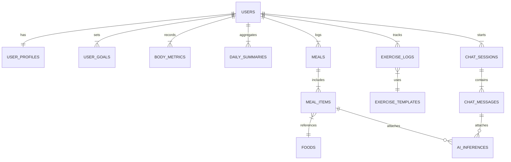

# NutriAI DB設計書

## 1. 前提とスコープ
- データストアはPostgreSQL 15を想定。PWA段階ではローカルモック(JSON/IndexedDB)で同一スキーマを再現し、API実装時に移行する。
- 個人情報(身長・体重等)を扱うため、暗号化(At Rest/Transit)とアクセス制御を適用する。
- 食品写真など大容量ファイルはオブジェクトストレージ(S3互換)で管理し、DBには参照URLのみ保持する。

## 2. ERドキュメント

## 3. データ型と命名規則
- 主キーはUUID(v4)、日時はUTCの`timestamptz`。
- 数量は`numeric(10,2)`、栄養素(g)は`numeric(7,2)`、体重は`numeric(5,2)`。
- テーブル名・カラム名はスネークケース。ENUMは`status_goal`, `activity_level`などのスキーマ定義を想定。

## 4. テーブル定義

### 4.1 ユーザー関連

#### users
| カラム | 型 | 制約 | 説明 |
| --- | --- | --- | --- |
| id | uuid | PK | ユーザーID |
| email | citext | UNIQUE, NOT NULL | ログイン用メールアドレス |
| password_hash | text |  | 認証方式がメールリンクの場合はNULL |
| login_provider | text | NOT NULL | `email`, `google`, `apple`等 |
| status | text | DEFAULT 'active' | `active`, `suspended`, `deleted` |
| created_at | timestamptz | DEFAULT now() | 作成日時 |
| updated_at | timestamptz | DEFAULT now() | 更新日時 |

#### user_profiles
| カラム | 型 | 制約 | 説明 |
| --- | --- | --- | --- |
| user_id | uuid | PK, FK(users.id) | ユーザーID |
| display_name | text |  | 表示名 |
| gender | text |  | `male`, `female`, `other`, `unset` |
| birth_date | date |  | 生年月日(不明可) |
| height_cm | numeric(5,2) |  | 身長(cm) |
| activity_level | text |  | `sedentary`, `light`, `moderate`, `active`, `athlete` |
| body_fat_pct | numeric(4,1) |  | 体脂肪率(%) |
| lifestyle_notes | text |  | 生活習慣メモ |

#### user_goals
| カラム | 型 | 制約 | 説明 |
| --- | --- | --- | --- |
| id | uuid | PK | 目標ID |
| user_id | uuid | FK(users.id) | 対象ユーザー |
| goal_type | text | NOT NULL | `loss`, `gain`, `maintain` |
| target_weight_kg | numeric(5,2) |  | 目標体重 |
| target_body_fat_pct | numeric(4,1) |  | 目標体脂肪率 |
| target_calorie_intake | numeric(6,0) |  | 1日目標摂取カロリー |
| target_duration_weeks | integer |  | 目標期間(週) |
| start_date | date | NOT NULL | 開始日 |
| end_date | date |  | 終了日 |
| status | text | DEFAULT 'active' | `active`, `completed`, `archived` |
| created_at | timestamptz | DEFAULT now() | 作成日時 |

#### body_metrics
| カラム | 型 | 制約 | 説明 |
| --- | --- | --- | --- |
| id | uuid | PK | 記録ID |
| user_id | uuid | FK(users.id) | ユーザー |
| recorded_on | date | NOT NULL | 記録日 |
| weight_kg | numeric(5,2) | NOT NULL | 体重 |
| body_fat_pct | numeric(4,1) |  | 体脂肪率 |
| skeletal_muscle_kg | numeric(5,2) |  | 骨格筋量 |
| notes | text |  | 備考 |
| source | text | DEFAULT 'manual' | `manual`, `wearable`, `import` |
| created_at | timestamptz | DEFAULT now() | 作成日時 |

### 4.2 日次集計

#### daily_summaries
| カラム | 型 | 制約 | 説明 |
| --- | --- | --- | --- |
| id | uuid | PK | 集計ID |
| user_id | uuid | FK(users.id) | ユーザー |
| summary_date | date | NOT NULL, UNIQUE(user_id, summary_date) | 対象日 |
| calorie_intake | numeric(6,0) | DEFAULT 0 | 摂取カロリー |
| calorie_burned | numeric(6,0) | DEFAULT 0 | 消費カロリー |
| protein_g | numeric(7,2) | DEFAULT 0 | タンパク質 |
| fat_g | numeric(7,2) | DEFAULT 0 | 脂質 |
| carb_g | numeric(7,2) | DEFAULT 0 | 炭水化物 |
| water_ml | numeric(7,2) | DEFAULT 0 | 水分量 |
| sleep_hours | numeric(4,2) |  | 睡眠時間(将来拡張) |
| tdee_estimated | numeric(6,0) |  | 推定TDEE |
| adherence_score | numeric(4,1) |  | 目標達成スコア |
| created_at | timestamptz | DEFAULT now() | 作成日時 |

### 4.3 食事関連

#### meals (2025-10-17更新)
| カラム | 型 | 制約 | 説明 |
| --- | --- | --- | --- |
| id | uuid | PK | 食事記録ID |
| user_id | uuid | FK(users.id) | ユーザー |
| date | date | NOT NULL | 記録日 (2025-10-17: logged_atから変更) |
| meal_type | text | NOT NULL | `breakfast`, `lunch`, `dinner`, `snack` |
| source | text | DEFAULT 'photo' | `photo`, `barcode`, `manual` |
| photo_url | text |  | 画像URL(モック時はローカルパス) |
| notes | text |  | 補足情報・料理詳細 |
| ai_estimated | boolean | DEFAULT false | AI推定済みか |
| created_at | timestamptz | DEFAULT now() | 作成日時 |

**変更点**: `logged_at`を`date`に変更し日毎の管理を容易化。時刻情報は不要なため日付のみで管理。

#### meal_items (2025-10-17更新)
| カラム | 型 | 制約 | 説明 |
| --- | --- | --- | --- |
| id | uuid | PK | 明細ID |
| meal_id | uuid | FK(meals.id) | 食事記録 |
| food_id | uuid | FK(foods.id) NULLABLE | 食品マスタ (2025-10-17: NULLABLEに変更) |
| food_name | text | NOT NULL | 食品名 (2025-10-17: 追加) |
| quantity | numeric(8,2) |  | 摂取量 |
| unit | text |  | `g`, `ml`, `個`, `人前`等 |
| calories | numeric(7,2) |  | kcal |
| protein_g | numeric(7,2) |  | タンパク質 |
| fat_g | numeric(7,2) |  | 脂質 |
| carb_g | numeric(7,2) |  | 炭水化物 |
| fiber_g | numeric(7,2) |  | 食物繊維 |
| confidence | numeric(3,2) |  | AI推定信頼度(0-1) |
| created_at | timestamptz | DEFAULT now() | 作成日時 |

**変更点**: `food_id`をNULLABLE化し、`food_name`を追加。AI推定やカスタム食品で食品マスタに存在しない場合でも記録可能に。

#### foods
| カラム | 型 | 制約 | 説明 |
| --- | --- | --- | --- |
| id | uuid | PK | 食品ID |
| name | text | NOT NULL | 商品名／食品名 |
| jan_code | text | UNIQUE | JANコード |
| brand | text |  | ブランド名 |
| serving_size | numeric(7,2) |  | 標準提供量 |
| serving_unit | text |  | `g`, `ml`, `個`等 |
| calories | numeric(7,2) |  | kcal per serving |
| protein_g | numeric(7,2) |  | タンパク質 |
| fat_g | numeric(7,2) |  | 脂質 |
| carb_g | numeric(7,2) |  | 炭水化物 |
| sugar_g | numeric(7,2) |  | 糖質 |
| salt_eq_g | numeric(7,2) |  | 食塩相当量 |
| category | text |  | 食品カテゴリ |
| external_source | text |  | 取得元 API |
| is_verified | boolean | DEFAULT false | 管理者検証済みか |
| created_at | timestamptz | DEFAULT now() | 作成日時 |
| updated_at | timestamptz | DEFAULT now() | 更新日時 |

### 4.4 運動関連

#### exercise_templates
| カラム | 型 | 制約 | 説明 |
| --- | --- | --- | --- |
| id | uuid | PK | テンプレートID |
| name | text | NOT NULL | 種目名 |
| category | text |  | `cardio`, `strength`, `mobility` |
| met_value | numeric(4,1) |  | MET値 |
| default_duration_min | integer |  | 推奨時間 |
| default_calories | numeric(6,0) |  | 目安カロリー |
| created_by | uuid | FK(users.id) | ユーザー作成時に設定 |
| created_at | timestamptz | DEFAULT now() | 作成日時 |

#### exercise_logs (2025-10-17更新)
| カラム | 型 | 制約 | 説明 |
| --- | --- | --- | --- |
| id | uuid | PK | 運動記録ID |
| user_id | uuid | FK(users.id) | ユーザー |
| template_id | uuid | FK(exercise_templates.id) NULLABLE | 利用テンプレート |
| name | text | NOT NULL | 運動名 (2025-10-17: 追加) |
| date | date | NOT NULL | 実施日 (2025-10-17: performed_atから変更) |
| duration_min | numeric(5,2) |  | 実施時間 |
| calories_burned | numeric(6,0) |  | 消費カロリー |
| intensity_level | text |  | `low`, `medium`, `high` |
| notes | text |  | 備考（例: 朝のジョギング） |
| created_at | timestamptz | DEFAULT now() | 作成日時 |

**変更点**: `performed_at`を`date`に変更し日毎の管理を容易化。`name`フィールドを追加し、テンプレート未使用の場合でも記録可能に。`template_id`をNULLABLE化。

### 4.5 チャット・AI関連

#### chat_sessions
| カラム | 型 | 制約 | 説明 |
| --- | --- | --- | --- |
| id | uuid | PK | セッションID |
| user_id | uuid | FK(users.id) | ユーザー |
| topic | text |  | `nutrition`, `training`, `mood`等 |
| context_snapshot | jsonb |  | セッション開始時のユーザー情報 |
| created_at | timestamptz | DEFAULT now() | 作成日時 |
| last_message_at | timestamptz |  | 最終メッセージ日時 |

#### chat_messages
| カラム | 型 | 制約 | 説明 |
| --- | --- | --- | --- |
| id | uuid | PK | メッセージID |
| session_id | uuid | FK(chat_sessions.id) | セッション |
| role | text | NOT NULL | `user`, `assistant`, `system` |
| content | text | NOT NULL | メッセージ本文 |
| context_tags | text[] |  | タグ(例: `["plateau", "protein"]`) |
| latency_ms | integer |  | 応答所要時間 |
| created_at | timestamptz | DEFAULT now() | 作成日時 |

#### ai_inferences
| カラム | 型 | 制約 | 説明 |
| --- | --- | --- | --- |
| id | uuid | PK | 推論ID |
| source_type | text | NOT NULL | `meal`, `chat`, `review`等 |
| source_id | uuid |  | 元データID |
| model_name | text |  | 利用モデル |
| input_summary | text |  | 入力の要約 |
| output_json | jsonb | NOT NULL | 推定結果(マクロ値、提案など) |
| confidence | numeric(3,2) |  | 信頼度 |
| created_at | timestamptz | DEFAULT now() | 作成日時 |

## 5. インデックス・ビュー
- `daily_summaries`: `(user_id, summary_date)`のユニークインデックスを作成。
- `meal_items`: `(meal_id)`, `(food_id)`で外部キー検索を高速化。
- `chat_messages`: `(session_id, created_at)`で時系列取得を最適化。
- `materialized view user_progress_monthly`: 月次サマリーを作成し進捗画面で利用。

## 6. モックデータ戦略
- TypeScriptの`@nutriai/contracts`で上記スキーマを定義し、モックは同じ型からサンプルJSONを生成。
- 開発初期は`/mocks/db.json`にユーザー3名分のデータを用意。食事写真はUnsplash等のプレースホルダーURLを利用。
- IndexedDB構成: `users`, `meals`, `exercise_logs`, `chat_messages`のローカルキャッシュを保持し、API移行時は差分同期用の`sync_queue`を追加。

## 7. 将来拡張
- ウェアラブル連携データ用に`device_tokens`, `import_jobs`, `sleep_logs`を追加予定。
- 多言語対応のため、食品名・カテゴリを`foods_i18n`テーブルで管理する構想。
- AIモデルバージョン管理のため、`ai_models`テーブルを追加し推論結果との関連を保持。
