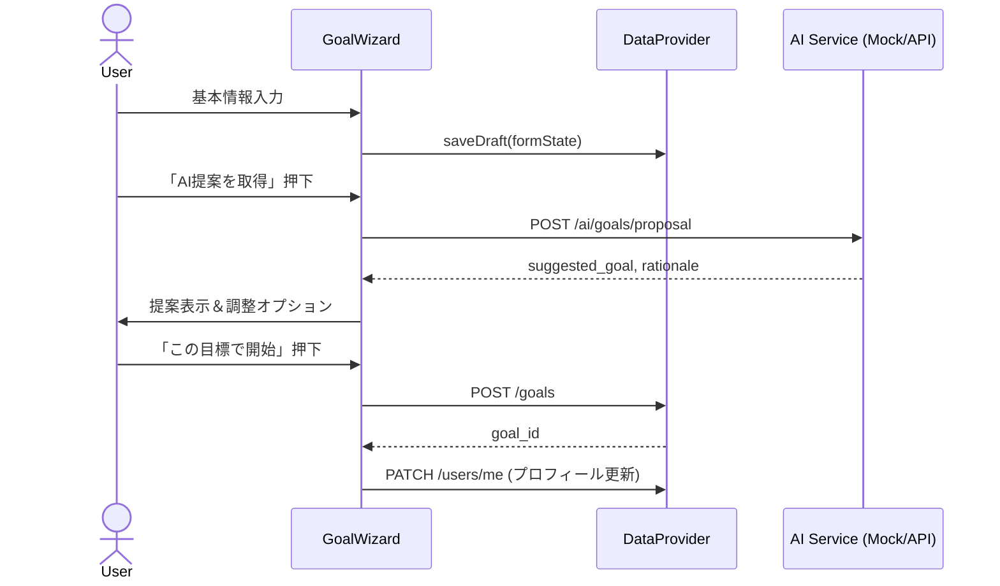
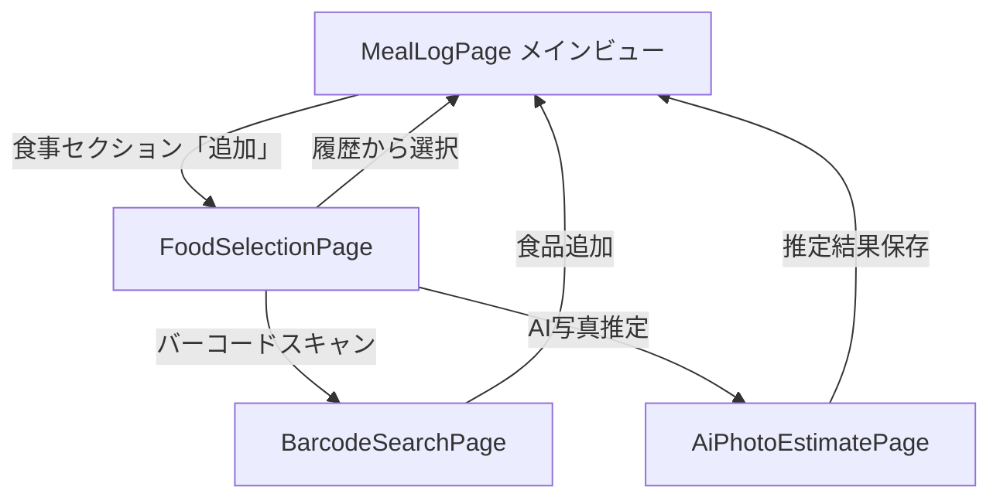
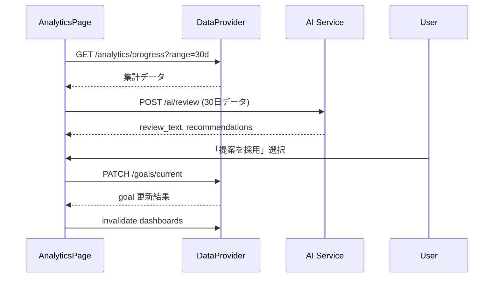

# NutriAI 機能詳細設計書

## 1. 文書目的
- 機能一覧`F-XX`の要件を具体的な処理フロー・データ連携・UI/サービス連携へ落とし込み、実装・テスト・モック運用の基準を定義する。
- 画面設計書、API設計書、DB設計書、コンポーネント設計書との整合を確認し、トレーサビリティを維持する。

## 2. 共通アーキテクチャ指針
- 状態管理: React Queryを主とし、フォームや一時データはZustand(またはReact Context)で補完。
- DataProvider: `mockAdapter` / `restAdapter` の2種を用意し、`useAppServices()`で依存注入。
- エラーハンドリング: API失敗時はトースト表示＋リトライ。オフライン時はIndexedDBの`sync_queue`へ保留。
- モック戦略: MSWでAPIスタブ。画像＆LLM処理はPromiseを使ったダミー実装で300ms遅延を挿入しUXを検証。

## 3. 機能別詳細

### F-01 初期設定 & AI目標提案
- 対応画面/コンポーネント: `SCR-02 GoalWizard`, `GoalWizardStepper`, `GoalSummaryCard`。
- 入力データ: 身長、体重、体脂肪率、年齢、性別、活動レベル、希望増減量、期間。
- 処理フロー:

- バリデーション: 身長/体重/体脂肪率は範囲チェック(身長100-220、体重30-200、体脂肪率0-70)。未入力はAI提案時に警告。
- モック動作: 入力値からBMR/TDEEを簡易算出するスタブを実装。`duration_weeks`は希望値がなければ12週デフォルト。
- エラー時: AI提案エラー→手動入力モードを表示。目標登録失敗→ローカルにドラフト保存しダッシュボードで再送導線。

### F-02 ダッシュボードサマリー
- 対応画面/コンポーネント: `SCR-03 DashboardPage`, `SummaryCard`, `TaskList`.
- データ取得: `GET /dashboard/today`で日次集計+タスク情報を取得。日付変更で`date`クエリを付与。
- 表示要素: 
  - ヘッダー: アバター、NutriAIロゴ、通知アイコン
  - 日付ナビゲーション（前後の矢印で日付切り替え）
  - カルーセル:
    - カロリーカード（円形プログレス表示、残り=目標摂取-食事摂取）
    - 主要栄養素カード（炭水化物・脂質・タンパク質の3つの円形プログレス）
  - ページネーションドット（2ページ間の切り替え）
  - 体重記録カード（現在の体重表示 + Collapsible簡易入力）
  - 今日のタスク（朝食記録、昼食記録、夕食記録、運動記録など）
  - クイックアクション（食事記録、運動記録）
- **カロリー計算式** (2025-10-18更新):
  - 残りカロリー = 目標摂取カロリー - 食事摂取カロリー
  - 運動消費カロリーは計算式に含めない（シンプル化のため）
- **日付ナビゲーション** (2025-10-18実装):
  - ChevronLeft/ChevronRightで前後の日付に移動
  - 「今日」「昨日」「明日」を自動判定して表示
  - それ以外の日付は「10月15日 (水)」形式で表示
  - 日付変更時に将来的にはAPIクエリパラメータで再取得
- 更新タイミング: 食事/運動/体重登録成功時にReact Queryの`dashboard`キーを`invalidate`.
- モック動作: JSONテンプレートを用意し、時間帯で進捗率を変化させる。タスクは`status: pending/completed`で管理。
- エラー/オフライン: キャッシュデータ表示 + オフラインバナー。再取得失敗時はトーストで通知。

### F-03 食事記録(写真AI推定) (2025-10-17大幅リニューアル、2025-10-28 Gemini連携対応)
- 対応画面/コンポーネント: 
  - `MealLogPage` (メインビュー、日毎管理)
  - `FoodSelectionPage` (検索・選択画面)
  - `AiPhotoEstimatePage` (AI写真推定専用ページ)
  
#### 画面遷移フロー

#### メインビュー (MealLogPage)
- **日付管理**: カレンダーピッカー + 前日/翌日ボタンで日付選択
- **日次サマリー**: 選択日の合計カロリー・PFC表示
- **食事セクション**: 朝食・昼食・夕食・間食の4セクション
  - 各セクションに複数の`MealItem`を追加可能
  - セクションごとの小計表示
  - アイテム削除機能
- **データ構造**: 
  - `Meal`: `date`, `mealType`, `items: MealItem[]`
  - `MealItem`: `foodName`, `quantity`, `unit`, `calories`, `proteinG`, `fatG`, `carbG`

#### 食品選択ビュー (FoodSelectionPage) (2025-10-22更新)
- **検索バー**: フード名での絞り込み
  - **データソース**: 日本食品標準成分表（文部科学省）を参照
  - **検索対象**: 食品名、読み仮名での部分一致検索
  - **栄養素データ**: カロリー、タンパク質、脂質、炭水化物を含む標準栄養成分
- **タブ切替**: すべて | マイミール | マイフード
- **すべてタブ**:
  - **クイックアクション**:
    - バーコードスキャンカード（既存画面へ遷移）
  - AI写真推定カード（専用ページへ遷移）
- **履歴リスト**: 最近追加した食品を表示、タップで即座に追加
- **標準食品データベース**: 
  - 文部科学省「日本食品標準成分表」の栄養成分データを統合
  - 一般的な食材（米、肉類、野菜、調味料等）の標準的な栄養素情報を提供
  - 100gあたりの標準値として表示、ユーザーが実際の摂取量を入力して栄養計算

#### AI写真推定ビュー (AiPhotoEstimatePage)
- **入力フロー**:
  1. 写真撮影/アルバム選択 → `photo_url`をローカルで生成
  2. 料理詳細入力（任意、複数行テキストエリア）
     - プレースホルダー例: 「鶏胸肉のグリル\nサラダ（レタス、トマト、きゅうり）\n玄米ご飯 150g\n味噌汁」
  3. 「AI推定を実行」ボタン → Next.js API (`POST /api/vision/analyze`) 経由でGoogle Gemini 2.5 Flash-Liteを呼び出し
     - レスポンス待ちの間はローディングスピナー＋「推定中…」メッセージを表示（目安3～5秒）
  4. 推定結果カードでGeminiから受け取った食品候補・栄養情報を表示し、スライダーで微調整
  5. 「登録する」押下 → メインビューに戻り即座に反映
- **推定精度向上のヒント**: 青いグラデーションカードで撮影のコツを3点表示
- **食品名抽出**: 料理詳細の1行目を自動的に食品名として使用

#### 推定処理 (Gemini連携)
- **BFF/API**: `POST /api/vision/analyze` がGoogle Gemini API (`https://generativelanguage.googleapis.com/v1beta/models/gemini-2.5-flash-lite-preview-02-05:generateContent`) を呼び出す
- **入力**: 
  - `parts`: 画像(Base64)と補足テキスト（最大500文字）を同じユーザーターンに含める
  - プロンプト: JSON形式での出力を指示（食品名、推定量[g]、栄養素、信頼度）
  - 言語: 日本語指示を優先するが、内部処理は英語ベースでも可
- **出力**: Geminiの生成レスポンス（JSON）をパースし、最大3件の食品候補と栄養情報を抽出。パース失敗時は補助ロジックでテキスト解析
- **栄養補正**: Supabaseの`jfct_foods`テーブル（日本食品標準成分表2020 八訂の取込結果）を照会し、名称マッチした食品コードの栄養値で上書き。ヒットしない場合はGemini推定値を採用し、データソースは`items[].source`に保持
- **メタ情報**: フロントには`meta.provider=gemini`と`meta.fallback`を返し、UIで表示切替（例: 「推定提供: Gemini」）
- **レート制御**: 1ユーザーあたり日次10リクエスト、全体では分間30リクエストで制限。超過時は警告トーストを表示し、モックに切り替え

#### フォールバック(モック)仕様
- Gemini APIがエラー(タイムアウト、レート超過など)の場合はMockVisionServiceを使用
- モック推定: ランダムなPFC値を生成、信頼度0.7～0.9でランダム化
- UIには「AI推定は参考値です(モック)」のバッジを表示
- 写真: Unsplashのプレースホルダー（モック）／実際のユーザー撮影写真（本番）
- 履歴データ: 固定の4件をrecentFoods配列で管理（モック時のみ）

#### エラーハンドリング
- 写真未選択時: バリデーションエラーをトースト表示
- Gemini呼び出し失敗時: トーストで理由表示（例: レート上限・APIエラー）。同時にフォールバック結果を提示し、再推定ボタンを活性化
- 食品名未入力時: エラーメッセージ表示
- レート上限超過時: 「当日のAI推定回数上限に達しました。明日までお待ちいただくか手動入力をご利用ください。」を表示

#### 同期処理
- 登録成功後、`meals`配列を更新しReactステートで即座に反映
- トースト通知でフィードバック
- ダッシュボードの日次サマリーも自動更新（将来的にReact Queryのinvalidate）

### F-03B マイフード（カスタム食品管理） (2025-10-18実装、2025-10-19更新)
- 対応画面/コンポーネント: `FoodSelectionPage`の「マイフード」タブ（旧`MyFoodsPage`の機能を統合）
- **機能概要**: ユーザーが独自の食品を登録・管理する機能
- **主要機能**:
  - カスタム食品の新規登録（食品名、分量、単位、カロリー、P/F/C）
  - 登録済み食品の編集・削除
  - 食事記録時にマイフードタブから選択可能
  - ダイアログUI（DialogDescription追加）でアクセシビリティ対応
- **データ構造**: `CustomFood` (id, name, servingSize, servingUnit, calories, proteinG, fatG, carbG, createdAt)
- **モック**: 3件のサンプルデータ（プロテインパンケーキ、自家製グラノーラ、特製スムージー）
- **バリデーション**: 食品名、分量、カロリーは必須入力
- **UI統合**: 2025-10-19更新 - ホームダッシュボードのマイフードボタンを削除し、食品選択ページのタブに機能を統合

### F-03C マイミール（カスタム料理作成） (2025-10-18実装、2025-10-19更新)
- 対応画面/コンポーネント: `FoodSelectionPage`の「マイミール」タブ + `MealCreateEditPage`（旧`MyMealsPage`の機能を統合）
- **機能概要**: 複数の食材を組み合わせて自分だけの料理を作成する機能
- **主要機能**:
  - 食品データベースから複数の食品を選択して組み合わせ
  - 各食品の分量を調整、合計栄養素を自動計算
  - ミール名を付けて保存
  - 写真追加、手順入力、公開設定（photoUrl, instructions, isPublic）
  - 登録済みミールの編集・削除
  - サムネイル付きリスト表示
  - 食事記録時にマイミールタブから選択可能
- **データ構造**: `CustomMeal` (id, name, foods[], totalCalories, totalProteinG, totalFatG, totalCarbG, photoUrl?, instructions?, isPublic?, createdAt)
- **モック**: 3件のサンプルデータ（朝の定番セット、ヘルシーランチボウル、プロテイン補給セット）
- **バリデーション**: ミール名と最低1つの食品が必須
- **栄養計算**: 各食品の分量に応じて栄養素を按分計算し、合計値をリアルタイム表示
- **UI統合**: 2025-10-19更新 - ホームダッシュボードのマイミールボタンを削除し、食品選択ページのタブに機能を統合
- **表記統一**: 2025-10-19更新 - 「脂肪」→「脂質」に統一

### F-04 JANコード検索
- 対応画面/コンポーネント: `SCR-05 BarcodeSearchPage`, `BarcodeScanner`, `FoodResultList`.
- 処理フロー:
  - カメラ/テキスト検索 → `GET /foods/barcode/{jan}` or `GET /foods/search?q=`.
  - ヒットした食品を選択して食事記録へ引き継ぎ(モーダル閉じて`MealLogPage`に`food_id`を渡す)。
  - 未登録時は`FoodManualForm`を表示し、`POST /foods`(管理者レビュー待ち)に送信(Phase2)。
- モック: 検索クエリに対しローカルJSONから部分一致。バーコード読み取りはテキスト入力で代替し、成功/失敗パターンをトグルで切り替え。
- エラー: 0件の場合は「手動登録」CTAを表示。検索失敗時は再試行ボタン。

### F-05 運動記録 (2025-10-17リニューアル)
- 対応画面/コンポーネント: `ExerciseLogPage`, `ExerciseForm`ダイアログ, `ExerciseTemplateList`.

#### 日毎管理機能
- **日付ナビゲーション**: カレンダーピッカー + 前日/翌日ボタンで日付選択
- **日次サマリー**: 選択日の合計消費カロリーと運動件数を表示
- **運動リスト**: 選択日の全運動記録を一覧表示
  - 運動名、時間、強度、消費カロリー、メモ
  - 各運動に削除ボタン
- **データ構造**: 
  - `Exercise`: `date`, `name`, `durationMin`, `caloriesBurned`, `intensityLevel`, `notes`

#### 追加フロー
1. **「追加」ボタン** または **人気の運動カード**をタップ → ダイアログ表示
2. **運動の種類**をドロップダウンから選択
3. **強度**を選択（低強度 | 中強度 | 高強度）
4. **時間（分）**を数値入力
5. **メモ（任意）**を入力（例: 朝のジョギング）
6. **消費カロリー**がリアルタイムで自動計算・表示
7. **「保存」**押下 → 運動リストに即座に追加

#### カロリー計算
- 計算式: `calories = MET * 3.5 * weight_kg / 200 * duration_min`
- 強度別係数: 低強度 0.8倍、中強度 1.0倍、高強度 1.2倍
- 体重: 最新`body_metrics`から取得（モックでは65kg固定）

#### テンプレート管理
- フロント内`mockExerciseTemplates`配列から読み込み
- 人気の運動として6件をグリッド表示
- タップで該当テンプレートを選択した状態でダイアログ表示

#### モック仕様
- テンプレート: ランニング、ウォーキング、スクワット、筋トレ、ヨガ、サイクリングなど
- カテゴリ別アイコン: cardio (Activity), strength (Dumbbell), mobility (Heart)

#### エラーハンドリング
- 運動種別未選択時: 保存ボタンを無効化
- 削除時: トースト通知でフィードバック

#### 同期処理
- 記録成功後、`exercises`配列を更新しReactステートで即座に反映
- ダッシュボードの日次サマリーも自動更新（将来的にReact Queryのinvalidate）

### F-06 体重・体脂肪ログ (2025-10-17実装完了)
- 対応画面/コンポーネント: 
  - `SCR-03 DashboardPage` (体重簡易入力 - Collapsible)
  - `SCR-07 AnalyticsPage` (詳細入力 - Popover + Calendar、記録履歴)

#### 2段階入力アプローチ

##### 1. ダッシュボード簡易入力
- **UI**: Collapsibleコンポーネントで展開式の入力フィールド
- **操作フロー**:
  1. 「今日の体重を記録」ボタンをタップ → フィールド展開
  2. 体重のみを数値入力（体脂肪率は入力不可）
  3. 「保存」ボタンで今日の日付で自動記録
  4. トースト通知表示 + 体重ミニグラフに即座に反映
- **バリデーション**: 体重20-300kg
- **コンポーネント**: `Collapsible`, `CollapsibleTrigger`, `CollapsibleContent`, `Input`, `Button`

##### 2. 進捗ページ詳細入力
- **UI**: Popover内のCalendarコンポーネントで日付選択
- **操作フロー**:
  1. 「記録日」ボタンをタップ → Calendarピッカー表示
  2. 任意の日付を選択
  3. 体重（必須）と体脂肪率（任意）を入力
  4. 「保存」ボタンで記録
  5. トースト通知表示 + グラフと履歴リストに即座に反映
- **バリデーション**: 体重20-300kg、体脂肪率0-70%
- **同日データ処理**: 既存データがある場合は上書き更新
- **コンポーネント**: `Popover`, `PopoverTrigger`, `PopoverContent`, `Calendar`, `Input`, `Label`, `Button`

#### 表示機能

##### ダッシュボード
- **体重ミニグラフ**: 直近7日間のラインチャート
- **最新体重表示**: 最新の記録値を大きく表示

##### 進捗ページ
- **期間フィルター**: 1ヶ月 | 3ヶ月 | 6ヶ月
- **体重折れ線グラフ**: 選択期間のデータを表示
- **記録履歴セクション**: 
  - 直近10件を降順リスト表示（最新が上）
  - 日付（日本語表記: 10月17日 (金)）| 体重 | 体脂肪率
- **目標との差分**: 開始体重からの変化量、目標体重までの残り

#### データ管理
- **ローカルステート**: `mockBodyMetrics`配列で管理
- **重複チェック**: 同一日付のデータがある場合は既存レコードを更新
- **ソート**: 日付の降順で自動ソート
- **再レンダリング**: `useState`のupdateTriggerで強制更新

#### バリデーション
- **体重**: 20-300kg（範囲外は拒否してエラートースト表示）
- **体脂肪率**: 0-70%（範囲外は拒否してエラートースト表示）
- **必須チェック**: 体重は必須、体脂肪率は任意

#### モック実装
- 初期データ: 10月10日〜17日の8日分のサンプルデータ
- 新規入力: 配列に追加し、日付でソート
- グラフ更新: データ変更時に即座に再描画

#### エラーハンドリング
- バリデーション範囲外: エラートースト表示、入力フィールドにフォーカス維持
- 通信失敗時: ローカルキューに保管し成功時に同期（Phase2対応予定）

#### 技術詳細
- **React.forwardRef対応**: `Button`コンポーネントでref forwardingを実装
- **日付フォーマット**: `toLocaleDateString('ja-JP')`で日本語表記
- **トースト**: `sonner@2.0.3`を使用

#### 実装日: 2025年10月17日

### F-07 月次レビュー & TDEE再提案
- 対応画面/コンポーネント: `SCR-07 ReviewCard`, `GoalAdjustmentDialog`.
- フロー:

- モック: `review_text`は複数テンプレから選択。目標採用時は`target_calorie_intake`を±150kcalで調整。
- エラー: AI呼び出し失敗→前回レビューを表示。ゴール更新失敗→警告を出し、後から再実行できるようにする。

### F-08 LLMチャット相談
- 対応画面/コンポーネント: `SCR-08 ChatPage`, `ChatTimeline`, `ChatComposer`.
- 入出力: ユーザー入力→`POST /ai/chat`→返信・推奨アクション。
- セッション管理: `session_id`を保持し、24時間でローテーション。新規セッション作成時は`POST /chat/sessions`(Phase2)。
- モック: Topic別プリセット回答。「栄養」「トレーニング」「気持ち」でテンプレを分岐。レスポンス遅延300ms。
- ストリーミング: 将来はSSEを計画。現状は単発レスポンス。
- エラー: 失敗時はリトライ気泡を表示し、バックオフ付きで再送。連続失敗でチャットガイドラインを提示。

### F-09 通知・リマインダー
- 対応画面/コンポーネント: `SummaryTaskList`, `ReminderSettings`(将来)。
- 目的: 記録漏れ防止。Phase1はダッシュボードタスクリストで代替。
- 処理: `GET /dashboard/today`のレスポンスに`tasks`配列(例: `{"type":"log_meal","status":"pending","deadline":"18:00"}`)を含め、表示・完了操作を制御。
- モック: 時刻に応じてタスク状態を切り替える。完了操作はフロントローカルのみ。
- 将来拡張: Service WorkerでPWA通知、`POST /notifications/register`でPushトークン登録、`/notifications/snooze`で後回し設定。

## 4. テスト観点
- フロー試験: ユースケース UC-01〜UC-06 をE2E (Playwright)で検証。モックサーバを利用し入力→結果の整合を確認。
- バリデーション: 数値入力境界値、AI提案失敗時のフォールバック、オフライン時再送キューの動作。
- アクセシビリティ: フォーカス移動、スクリーンリーダー用ラベル、チャット画面のロール属性。

## 5. 今後の課題
- AIモデル選定と提示ロジックの精緻化(信頼度に応じたUI変化)。
- 画像アップロードの圧縮・EXIF除去処理の実装。
- 目標/サマリーの多言語対応と単位変換(kg⇔lbs)。
